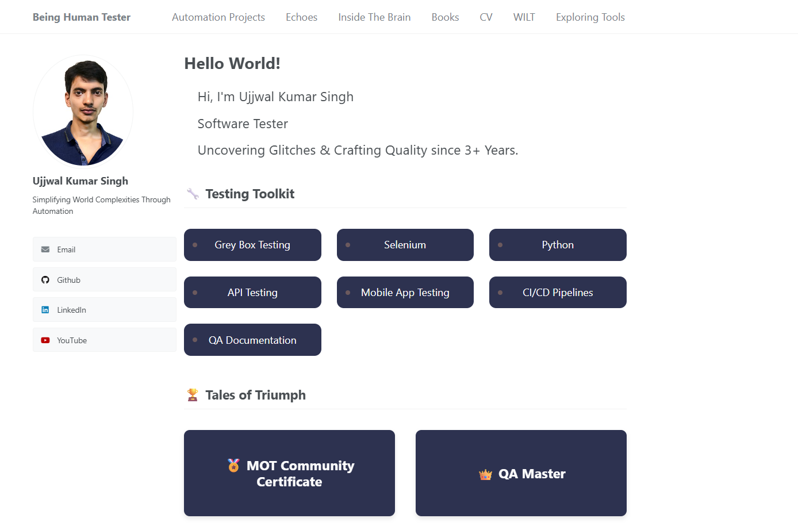

# 👋 About Me

Hi, I’m **Ujjwal Kumar Singh**, a Software Tester with 3 years of hands-on experience in functional, API, database, and automation testing. I’m passionate about crafting better testing strategies, exploring AI’s role in quality assurance, and building meaningful tools and frameworks to improve testing efficiency.  

This portfolio is a reflection of my testing journey, the tools I explore, the articles I write, and the things I learn every day.

---

# Ujjwal Kumar Singh – Portfolio Website

This repository hosts the source code for my personal portfolio website, built using the [Academic Pages](https://academicpages.github.io/) Jekyll template, originally based on the [Minimal Mistakes](https://mmistakes.github.io/minimal-mistakes/) theme.

The site is designed to present my professional journey, testing projects, written work, and curated resources all in one place.



 **Website**: [https://beinghumantester.github.io](https://ujjwalkumarsingh.github.io)

---

##  Website Overview

The portfolio is organized into meaningful sections for easy navigation and clarity:

- **Automation Projects**  
  A showcase of my automation testing work, including project details and GitHub links.

- **Echoes**  
  A collection of my published articles and public talks, highlighting my engagement with the testing community.

- **Inside the Brain**  
  Original blogs and personal insights related to software testing and technology.

- **Books**  
  A list of books I’ve read along with personal notes and takeaways.

- **Resources**  
  A compilation of practical resources on test planning, automation frameworks, and strategies.

- **CV**  
  A detailed overview of my professional background and a downloadable copy of my CV.

- **WILT (What I Learned Today)**  
  Daily learning logs capturing small but meaningful insights from my day-to-day work.

- **Exploring Tools**  
  A list of tools I’m currently exploring or using to improve productivity and testing workflows.

---

##  Running the Site Locally

To preview or contribute to the site, follow the setup instructions below:

### Prerequisites

- Ruby (with `ruby-dev`)
- Bundler
- Node.js

Install the required dependencies:

```bash
# On Ubuntu/Linux
sudo apt install ruby-dev ruby-bundler nodejs

# On macOS
brew install ruby node
gem install bundler

Install Ruby gems:

bash
Copy
Edit
bundle install
Run the site locally:

bash
Copy
Edit
jekyll serve -l -H localhost
Access the local version at: http://localhost:4000

🐳 Running with Docker (Optional)
To run the site in a containerized environment using Docker:

Build the Docker image:
bash
Copy
Edit
docker build -t jekyll-site .
Run the container:
bash
Copy
Edit
# On Linux/macOS
docker run -p 4000:4000 --rm -v ${PWD}:/usr/src/app jekyll-site

# On Windows (PowerShell)
docker run -p 4000:4000 --rm -v ${PWD}:/usr/src/app jekyll-site

# On Windows (Command Prompt)
docker run -p 4000:4000 --rm -v C:\path\to\your\site:/usr/src/app jekyll-site
Make sure Docker has access to the correct drive under Docker Desktop → Settings → Resources → File Sharing.

About the Theme
This site is based on the Academic Pages template, which was forked from the Minimal Mistakes Jekyll Theme. While it originally served academic needs, I have adapted and maintained a detached version tailored to reflect my profile and portfolio.

For issues or suggestions related to the core theme, please refer to the Academic Pages GitHub repository.

Thank you for visiting. Whether you're here to explore my work, collaborate, or learn more about software testing practices... welcome!
